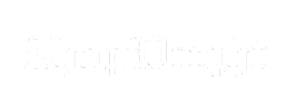

<div align="center">
  
  <p><em> A Dungeons & Dragons Shop Generator </em></p>
</div>

---
#### `>>>` DevHCarter
---
# Table of Contents:

- [Installation & File Structure](#installation)
- [Roadmap](#Roadmap)
- [Functionality](#functionality)

---

## Installation

Installation is very straight foward, but for those who arent familiar, here is a step by step guide:

1. Hit the green `Code` button at the top right of this page, and click download ZIP
2. Once downloaded, move the folder to your desired location, and unzip (or just move file contents to another file in that location)
3. Install [Python](https://www.python.org/downloads/) make sure you have a somewhat modern version (3.12+)
4. Right click `shop.py` and run!

## File Structure

```
Folder Name
├── assets
|    └── shopwright_24px.png       # Just a .png you see above :p
├── data      
|    └── shops.db                  # Where your shop preferences and saves are stored
|    └── Jacquard24-Regular.ttf    # A custom font     
├── shop.py                        # The actual shop (psst, run this)
├── README.md                      # Basic information about the project        
└── Items_Beta_1.csv               # Item Database
```
---
## Roadmap

I have some optimistic plans for this project, and I am 100% open to suggestions for future features, or if anyone wants to make their own plugin, please do!

As of now, here are the goals as of now:

- [ ] Shop Info Tab Update
- [ ] Spell Scroll/Enspelled Item Randomizer
- [ ] 1.0 Release
- [ ] Player-viewable shop interface
- [ ] Loot Generator (Dragon Horde too)

---

# Functionality

### Generating a Shop

1. Select a **Shop Type** from the dropdown (Alchemy, Blacksmith, Magic, etc.)
2. Click **Name** to generate a random shop name, or type your own
3. Set **City Size** and **Wealth** in the Stock Settings tab
4. Include or exclude any particular tags based on the desired shop
5. Click **Generate Shop**

### Shop Types
Alchemy · Armory · Blacksmith · Fletcher · General Store · Jeweler & Curiosities · Magic · Scribe & Scroll · Stables & Outfitter

### City Size
Controls how many items appear and quantity of each:
| Size | Item Count |
|---|---|
| Village | 10–15 |
| Town | 15–25 |
| City | 25–35 |
| Metropolis | 35–60 |

### Wealth-Rarity Disribution
| Wealth | Common | Uncommon | Rare | Very Rare | Legendary | Artifact |
|---|---|---|---|---|---|---|
| Poor | 55% | 30% | 15% | 0% | 0% | 0% |
| Average | 40% | 30% | 24% | 5% | 1% | 0% |
| Rich | 30% | 25% | 20% | 15% | 10% | 0% |

---

### Items

- ### Tags
    All shops can be customized to include, or exclude certain items based on its tags. All tags are listed below

    ##### **Race/Culture:** 
    ###### Drow, Draconic, Dwarven, Elven, Fey, Fiendish, Giant
    
    ##### **Element/Damage Type:** 
    ###### Acid, Fire, Force, Ice/Cold, Lightning, Necrotic, Poison, Psychic, Radiant, Thunder, Slashing, Piercing, Bludgeoning 
    
    ##### **Type(Taken from 5e.tools):** 
    ###### Adventuring Gear, Ammunition, Artisans, Tools, Amulet/Necklace, Belt, Book/Tome, Boots/Footwear, Card/Deck, Cloak, Dust/Powder, Figurine, Food/Drink, Gloves/Bracers, Headwear, Instrument, Potion, Ring, Rod, Scroll, Staff, Tattoo, Tools, Wand, Other, Trade Good, Spellcasting Focus, Wonderous
    
    ##### **Weapon & Armor:** 
    ###### Armor, Finesse, Generic Variant, Heavy Armor, Heavy Weapon, Light Armor, Light Weapon, Medium Armor, Melee, Ranged Weapon, Shield, Thrown, Two-Handed, Versatile, Weapon
    
    ##### **Rarity:** 
    ###### Artifact, Common, Legendary, Mundane, Rare, Uncommon, Very Rare

- ### Item Categories

    ##### Staples:
    
    ###### Staples are items that will *always* appear in a particular shop. These items are typically mundane or common and are hand-picked and only consist of a few items per shop type. These items do not count against the total number of items in the pool. 
    
    ##### Semi-Staples:
    ###### Semi-Staples are similar to Staples, but have a *50%* chance to be included in the shop pool. These items do not count against the total number of items in the pool. 
    
    ##### Primary Items:
    ###### Primary items are what make up the majority of the items in the .csv file; basically all magical items that exist.


---

### Quantity System
Each item gets a quantity based on `ceiling(size_mod × weight + 1)`:
- `size_mod` is a random float drawn from a city + rarity range table below
- `weight` (0–3) is inferred from the item -- consumables stack most, legendary items are always singular


Size Mod Table

| Rarity | Village | Town | City | Metropolis |
|---|---|---|---|---|
| Mundane | 0 – 5 | 0 – 10 | 2 – 15 | 5 – 30 |
| Common | 0 – 2 | 0 – 4 | 1 – 5 | 3 – 15 |
| Uncommon | 0 | 0 – 2 | 1 – 4 | 2 – 6 |
| Rare | 0 | 0 | 0 – 3 | 0 – 5 |
| Very Rare | 0 | 0 | 0 – 1 | 0 – 1 |
| Legendary | 0 | 0 | 0 | 0 |

---

### Price Modifier
Slider in the Action tab adjusts all displayed prices from 50% to 125% of list price. Useful for haggling, special sales, or greedy shopkeepers.

### Item Locking
Double-click any item to lock it. Locked items survive rerolls and regeneration in case you want to save it for your party later.

### Reroll Button
Replaces 10–30% of unlocked items with fresh picks, keeping the shop feeling dynamic between visits.

### Sell Item Tab
Look up any item for a player to sell it back to the shopkeeper. Default buy-back percentage is 80%.

### Campaigns & Saves
Save shops to a local SQLite database organized by Campaign -> Town-> Shop. Load, export to JSON, or import from JSON for sharing or backups.

### Item Gallery
Browse the full item database with search, rarity filter, source filter, and tag filters.

### Shopkeeper Generator
An optional way of generating NPC's that run the shop. You can customize the races that can generate in the `App Settings` tab at the top right.

### Shop Info
This is a large index of information that contains a lot of information about shop categories as a whole and includes things like services offered, prices for said services, information about the current shop, as well as some tips and tricks on how to generate any shop to your liking.

### Transaction Log
When a player buys an item, you can right click on it and have a record of the sale stored permanently; you can organize the log by session number, or shop name.
